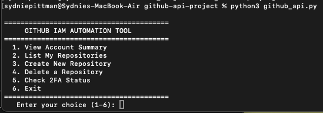
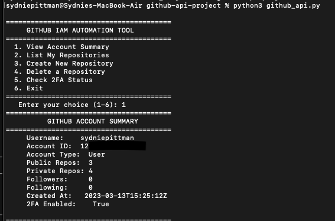
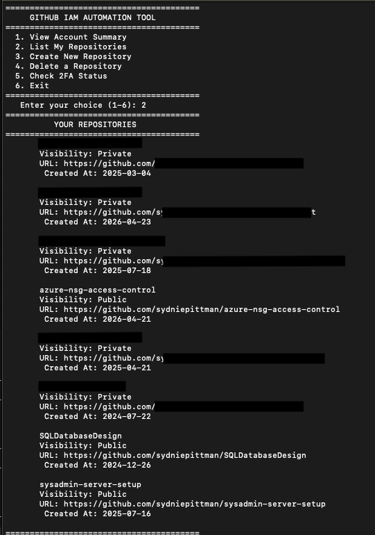
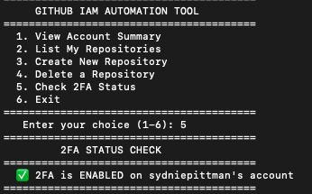
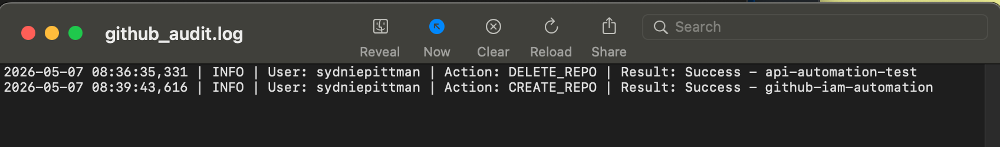

# GitHub IAM Automation Tool

A menu-driven Python tool that automates GitHub account 
management via the GitHub REST API.

## Features
- View account summary including 2FA status
- List all repositories with visibility and metadata
- Create new repositories with custom settings
- Delete repositories with confirmation prompt
- Audit logging of all actions with timestamps

## Technologies Used
- Python 3
- GitHub REST API
- Environment variable authentication (no hardcoded tokens)
- Python `logging` module for audit trails

## Security
- Token stored as environment variable, never hardcoded
- All actions logged to `github_audit.log` with timestamps
- Confirmation prompt required before destructive actions

## What I Learned
- REST API authentication with Bearer tokens
- GET, POST, and DELETE HTTP methods
- Error handling with try/except
- Audit logging for compliance and accountability
- Menu-driven CLI tool design

## Screenshots

**Menu Interface**

**Account Summary**

**Repository List**

**2FA Status Check**

**Audit Log**

